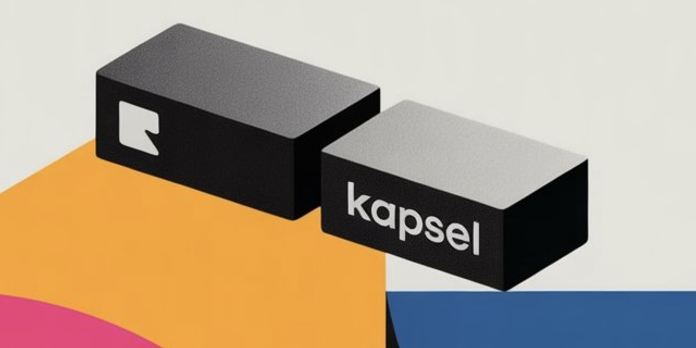

<p align="center">
  
</p>

<p align="center">
  <b><a href="docs/STATUS.md">Status</a></b>
  &nbsp;|&nbsp;
  <b><a href="docs/ARCHITECTURE.md">Architecture</a></b>
  &nbsp;|&nbsp;
  <b><a href="docs/ATTESTATION.md">Attestation</a></b>
  &nbsp;|&nbsp;
  <b><a href="docs/TESTING_STRATEGY.md">Testing Strategy</a></b>
  &nbsp;|&nbsp
  <b><a href="docs/STYLE.md">Style Guide</a></b>
</p>

> [!WARNING]
> Kapsel is in a pre-release, alpha stage.
>
> The API is unstable, features are incomplete, and breaking changes should be expected.

## The Problem

Webhooks fail. When they do, they fail silently.

Network timeouts, server errors, and rate limits lead to lost events, out-of-sync data, and a complete lack of a verifiable audit trail. You're left with no record and, worse, no proof of delivery.

## The Hook

Kapsel is a webhook reliability service for building guaranteed at-least-once delivery systems.

- **Zero Loss** - Every webhook persisted before acknowledgment
- **Exactly Once Processing** - Database-enforced idempotency
- **At-Least Once Delivery** - Exponential backoff with circuit breakers
- **Cryptographic Proof** - Merkle tree attestation with Ed25519 signatures

## Development

```bash
# Clone this repository
git clone https://github.com/kapsel-hq/kapsel
cd kapsel

# Run tests
cargo make test

# Run the dev server
cargo make dev
```

Read [`Makefile.toml`](Makefile.toml) for all avaliable [`cargo-make`](https://github.com/sagiegurari/cargo-make) tasks.

## License

Licensed under the [`Apache License, Version 2.0`](LICENSE)
